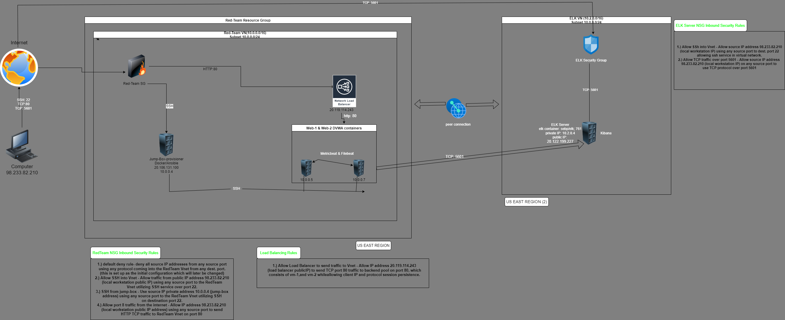

## Automated ELK Stack Deployment

The files in this repository were used to configure the network depicted below.

These files have been tested and used to generate a live ELK deployment on Azure. They can be used to either recreate the entire deployment pictured above. Alternatively, select portions of the _____ file may be used to install only certain pieces of it, such as Filebeat.

This document contains the following details:

- Description of the Topology
- Access Policies
- ELK Configuration
  - Beats in Use
  - Machines Being Monitored
- How to Use the Ansible Build

### Description of the Topology

The main purpose of this network is to expose a load-balanced and monitored instance of DVWA, the D*mn Vulnerable Web Application.

- Load balancing ensures that the application will be highly available, in addition to restricting access to the network.
- The primary function of a load balancer is to spread workloads across multiple servers to prevent overloading servers, optimize productivity, and maximize uptime. Load balancers also add resiliency by rerouting live traffic from one server to another if a server falls prey to DDoS attacks or otherwise becomes unavailable. In this way, load balancers help to eliminate single points of failure, reduce the attack surface, and make it harder to exhaust resources and saturate links.
-  What is the advantage of a jump box? A jumpbox, when configured correctly, creates a single point of entry into your network. When ssh key is used to establish connection between host and jumpbox, and private ip's are used for other vm's on network and all connections are then forced through jumpbox, the attack surface is greatly reduced.

Integrating an ELK server allows users to easily monitor the vulnerable VMs for changes to the data and system logs.
- Filebeat will collect log events and gather data about the file system.
- Metricbeat will be used to monitor and collect metrics from the system and services running on each server.

The configuration details of each machine may be found below.
_
|         Name         |                  Function                 |   IP Address  |     Operating System    
|:--------------------:|:-----------------------------------------:|:-------------:|:-----------------------:|
| Jump Box Provisioner | Gateway                                   | 10.0.0.4      | Linux Ubuntu 18.04-LTS  |   
| Local Workstation    | Configurating network externally          | 98.233.82.210 | Windows 10 Pro Edition  |   
| Web-1 VM             | Process and deliver web content to user   | 10.0.0.5      | Linux Ubuntu 18.04-LTS  |   
| Web-2 VM             | Process and deliver web content to user   | 10.0.0.7      | Linux Ubuntu 18.04-LTS  |   
| ELK-Server           | Collect and process data from Web VMs     | 10.2.0.4      | Linux Ubuntu 18.04-LTS  |   
| Load Balancer        | Distribute Traffic to backend server pool | 20.119.114.243| N/A                     |   

### Access Policies

The machines on the internal network are not exposed to the public Internet. 

Only the jump-box(gateway) machine can accept connections from the Internet. Access to this machine is only allowed from the following IP addresses:
- 98.233.82.210

Machines within the network can only be accessed by jump box provisioner.
- 10.0.0.4

A summary of the access policies in place can be found in the table below.

| Name     | Publicly Accessible | Allowed IP Addresses |
|----------|---------------------|----------------------|
| Jump Box | No                  | 98.233.82.210        |
|          |                     |                      |
|          |                     |                      |

### Elk Configuration

Ansible was used to automate configuration of the ELK machine. No configuration was performed manually, which is advantageous because...

- The first benefit of all of this is saving time. Before automation, system administrators had to spend hours configuring machines
  manually, after Ansible, the time required to configure the whole process is less than 3 minutes! The second benefit is reducing
  bugs and errors related to human error.Automated provisioning with Ansible also provides for homogeneity, or IaC (Infrastructure as Code),
  allowing you to write scripts in one location and have it filter to the appropriate locations. This ensures all locations are running the 
  same scripts and are identical. 

The playbook implements the following tasks:
- _TODO: In 3-5 bullets, explain the steps of the ELK installation play. E.g., install Docker; download image; etc._
- ...
- ...

The following screenshot displays the result of running `docker ps` after successfully configuring the ELK instance.

### Target Machines & Beats
This ELK server is configured to monitor the following machines:

- 10.0.0.5
- 10.0.0.7

We have installed the following Beats on these machines:

- Filebeat
- Metricbeat

These Beats allow us to collect the following information from each machine:

- Filebeat collects and aggregates various log events regarding the file systems on a host. For example, we can process logs for SSH logins
  to determine successful and failed login attempts into the system. Metricbeat reports on the health of a system and collects various machine
  metrics such as uptime, memory usage, and Network I/O. We can also specifically monitor CPU usage on a host and determine if it is being used
  as expected or is being exhausted with the potential to fail.

### Using the Playbook
In order to use the playbook, you will need to have an Ansible control node already configured. Assuming you have such a control node provisioned: 

SSH into the control node and follow the steps below:

- Copy the filebeat-config.yml file to /etc/ansible/files/filebeat-config.yml.
- Update the filebeat-config.yml file to include the installation path, username/password,
  the IP address of the ELK server under outpout.elasticsearch within the configuration file,
  and the IP address and port number under the setup.kibana field.
- Run the playbook, and navigate to http://[public IP address of ELK Server]:5601/app/kibana
  to check that the installation worked as expected. To confirm that the ELK server is receiving
  logs from Web-1 and Web-2 you will navigate from within the Kibana GUI to Add Log Data --> System Logs
  --> DEB tab --> Step 5: Module Status --> Check Data.

- Which file is the playbook? Where do you copy it?_filebeat-playbook.yml. It will be copied in the /etc/ansible/roles/filebeat-playbook.yml directory.

- Which file do you update to make Ansible run the playbook on a specific machine? How do I specify which machine to install the ELK server
  on versus which to install Filebeat on? This can be defined within the Ansible Hosts file. Under the "webservers" grouping, we listed the VM's
  that will be configured with Filebeat. In addition, within the same file we created an "elk" group to specify the VM that will be configured
  with the ELK server.

- Which URL do you navigate to in order to check that the ELK server is running? http://[public IP address of ELK Server]:5601/app/kibana

_As a **Bonus**, provide the specific commands the user will need to run to download the playbook, update the files, etc._

